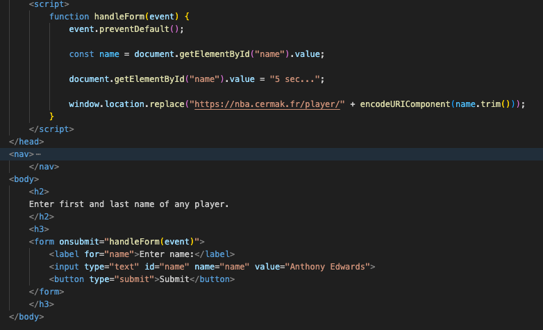
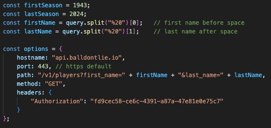
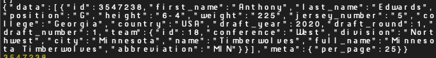
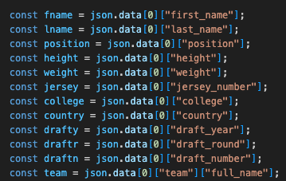
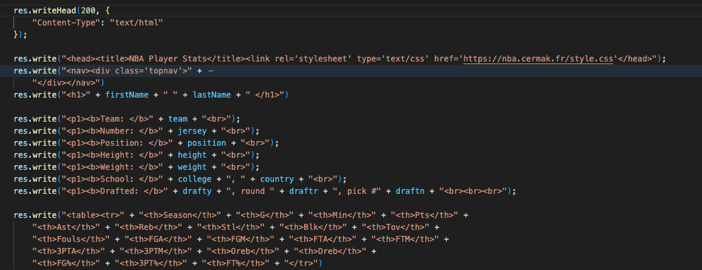
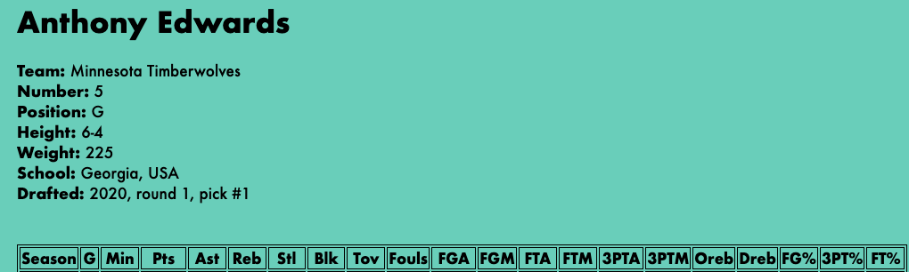
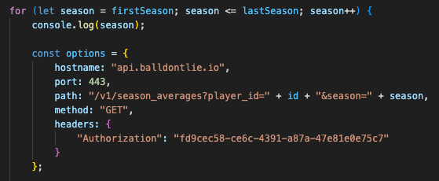
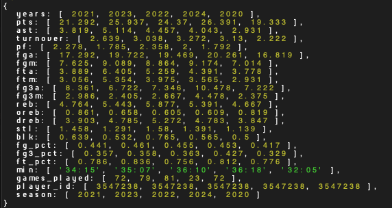
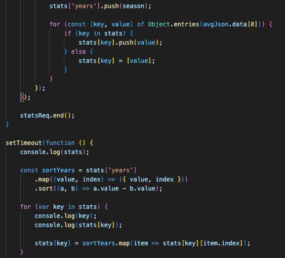

# Final Project

Link to Presentation: https://docs.google.com/presentation/d/1jyeAEGDDjMUegqACbhKGmtyaisYtnDuRL-arcJQ40JQ/edit?usp=sharing

Link to Project: https://nba.cermak.fr

# Documentation

I have to admit that when coming up with the idea for this project originally, I drastically underestimated how challenging it would be to put together and implement even half of the features I had intended. In the end, although I didn't completely reach my goal, I learned so much from the experience and would definitely do a project like it again. 

When starting this project, I reached out to my friend Maxwell for advice on the different ways I could go about putting it together. Maxwell and I have worked together on projects such as VST plugins or even Minecraft mods, and he has a bit more experience in this area than I do. He helped me in setting up node.js and how I would configure it to run remotely on our shared cermak.fr server.

The structure of the site works something like this: when the user connects to 'nba.cermak.fr', it requests the path name in the URL, or everything after the slash. If nothing is there, it sends the user to the 'landing.html' page. Here, the user has the option to go to the Players, Teams, or Games pages. When the link is pressed, it changes the path name in the URL to that specific page (eg. nba.cermak.fr/player.html), which then loads that particular HTML file.

Starting from the 'player.html' page, there's a text box where the user will input the first and last name of a player. On submission, a script takes this string and adds it to the path in the URL after '/player/' (eg. nba.cermak.fr/player/Anthony%20Edwards). Back in project.js, because the URL now has '/player', the "returnPlayer" function is run with the query given after the slash, which in this case is the name of the player. The '%20' is removed and the first and last name are taken and added to the path of the balldontlie.io request.

After receiving the request, balldontlie.io responds with data about that player, and also gives the specific ID associated with that player, which we'll use in a little bit when we request more data. From here, we can take specific variables from the data like 'college', 'height', 'weight', etc. 

Then, we begin to construct the results page with HTML, listing the basic info about the player at the top of the page, and also starting the table in which the season averages stats will be placed later.

Now, we can call the players season stat averages using the ID we got before. This time, it's done season by season, so it's being run in a loop. It responds the same way as before, although this time it's given in an array. 

At this point, I ran into an incredibly annoying issue which I still don't completely understand the reason for. For some reason, when the data is returned by season, the seasons are listed out of order, as you can see in the image. Thankfully it's correctly organized by year but they aren't being returned in the right order. For this reason, I needed to find away to sort all of the stats based solely on the season, not mixing them up in the process. To do this, I essentially made it so that the year and stats that follow are two separate indexes, and that after the years index is sorted chronologically, the 'stats' index is mapped to the years. 

